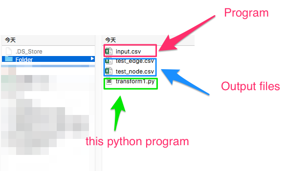
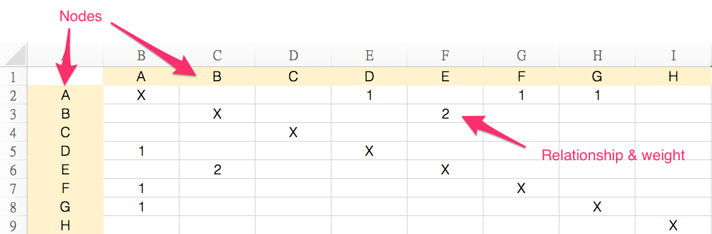
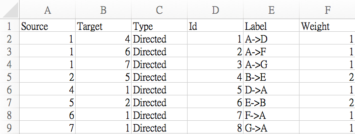
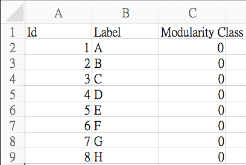
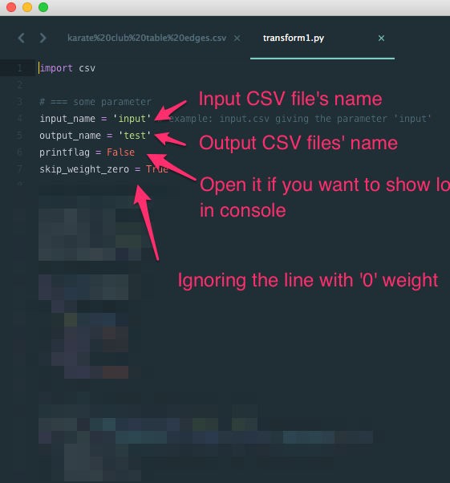

# GephyTableConverter

### About
This project includes two parts: 

1. Text to Speech Conversion
2. Speech to Text Conversion

However, to help transcribing voice recording to text easier, the main propose of this project is generating a well-organized file that includes each sentence of yoru voice recording files.

### Setup

Put the files in same folder

### Requirements
* Run it with Python 2

### Input
CSV file with this kind of format (You can make or transform it with Excel)

### Output

Output will be two csv files and both can import to Gephy

* Edge data:

* Node data:

### Parameter

### How to import to Gephy

* Open your file with Audicity and choose "Analyze → Silence Finder..."

* Change the settings, then press "OK"

 

* Click "File → Export Multiple..."

* Check export format and name files as the following settings, then export all files to same directory

### License

MIT License