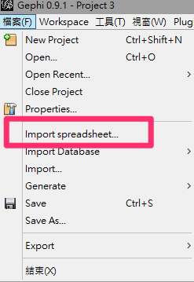
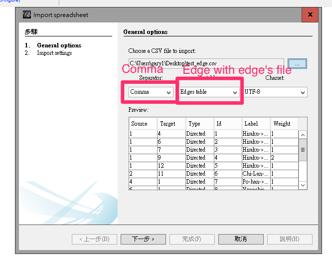
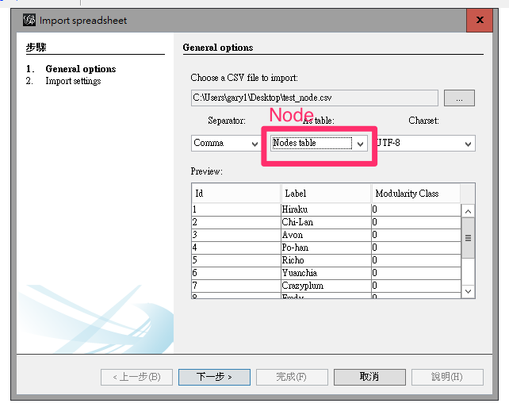
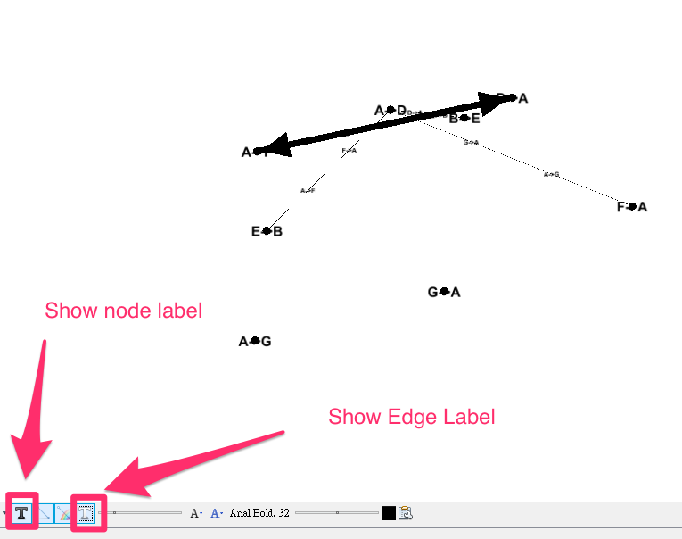

# GephyTableConverter

### About
Target of this project is: 

1. Finish Social Computing Assignment 3
2. Convert excel specific format table into Gephy inputed format
3. If you don't know how to use it, please contact [Gary](mailto:garynil1635@gmail.com)

### Setup

* Put the files in same folder

### Requirements
* Run it with Python 2

### Input
CSV file with this kind of format (You can make or transform it with Excel)

### Output

Output will be two CSV files and both can import to Gephy

* Edge data( NAMEYOUCHOOSE_edge.csv ):

* Node data( NAMEYOUCHOOSE_node.csv ):

### Parameter

You can change parameters in the code for different results:

### How to import to Gephy

* Open a new Gephy project and import Spreadsheet"

* Choose Edge CSV file and import it, remember to change the setting to 'Comma' and 'Edges table'

* Import the node table in same way. Still remember to change the setting into node table

* Then the result will show

* Also you can open the label for more information

### License

MIT License